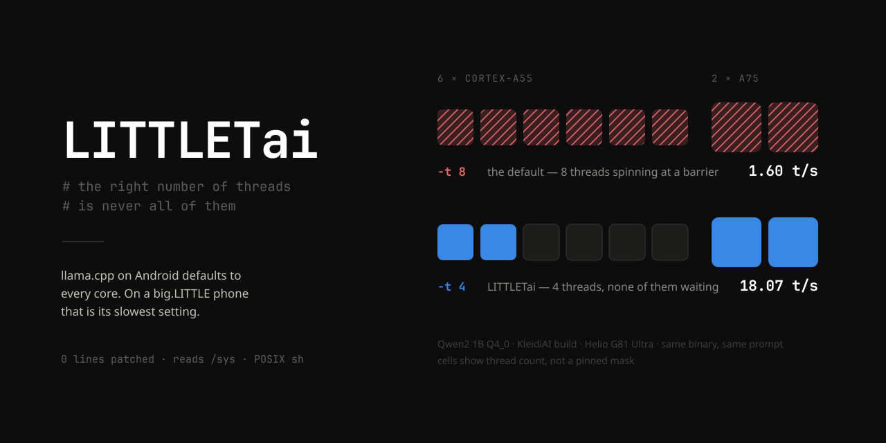
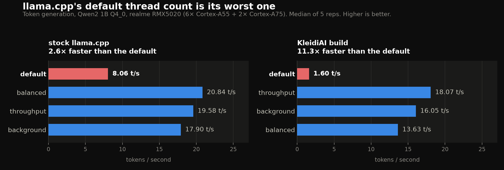
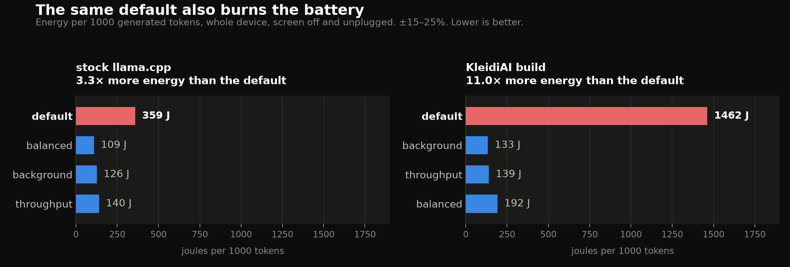
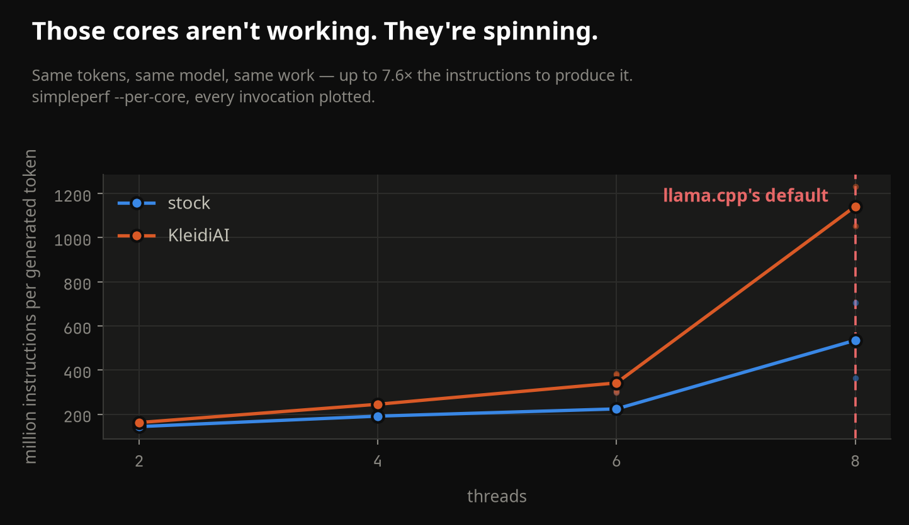

# LITTLETai

> *The right number of threads is never all of them.*

`LITTLETai` reads your phone's CPU layout and tells llama.cpp how to use it.
The name is `big.LITTLE` plus AI, and a nod to the little phones, the mid-range
Helio and Snapdragon handsets most of the world actually owns, which is where I
did all of this.

It turns out llama.cpp has been leaving a lot on the table there. Not a little.
On my test phone, generating tokens:

| | stock llama.cpp | KleidiAI build |
|---|---|---|
| default (`-t 8`) | 8.06 t/s · 359 J/1k tok | 1.60 t/s · 1462 J/1k tok |
| any LITTLETai preset | 17.9–20.8 t/s · 109–140 J/1k tok | 13.6–18.1 t/s · 133–192 J/1k tok |
| | **2.2–2.6× faster** | **8.5–11.3× faster** |
| | **2.6–3.3× less energy** | **7.6–11× less energy** |

Same model, same prompt, and within each column the same binary. The only thing
that changed is a couple of CLI flags.

<sub>Throughput is llama.cpp's own per-repetition `samples_ts`, so it excludes
model load. Energy is whole-invocation and **does** include model load and
warmup, which is 2.6–38.8% of the window depending on the arm. Integrating over
only the benchmarking portion gives 352 → 101 J/1k tok on stock (3.5×) and 1115
→ 108 on KleidiAI (10.3×), so the claim holds either way; the table just uses
the number that was measured rather than the one that was modelled. Device-wide
draw, ±15–25%.</sub>

```console
$ ./llama-cli -m model.gguf -p "hello"                                #  1.6 t/s   (stock:  8.1)
$ sh cpupreset.sh throughput -- ./llama-cli -m model.gguf -p "hello"  # 18.1 t/s   (stock: 19.6)
```

<sub>Which binary you built changes the size of the win, not its direction, so
both are given: the leading number is the KleidiAI build, where the default is
at its worst, and stock is in parentheses. Everything below follows the same
convention, and the two measured binaries are `llama-bench` (stock) and
`llama-bench-kai` (KleidiAI).</sub>





<sub>Both charts share one x-scale across the two panels, so the bars are
comparable between builds as well as within them. Regenerate with
`.venv/bin/python llama.cpp/harness/hero_figures.py`; the values are read from
`results.json`, never typed in.</sub>

These are not the first numbers I got, and the first ones were wrong in a way
worth admitting up front. The two 97-arm matrices were collected with both
cpufreq policies vendor-clamped to 850 MHz against a rated 1.7 and 2.0 GHz, and
the rule I pulled out of them, that prefill wants *every* core, is an artifact
of that clamp. It is false at full clock. A dedicated sweep retired it, which is
why `throughput` reserves a core today instead of taking all eight.
[`PRESETS.md`](llama.cpp/harness/PRESETS.md) keeps the retired version next to
the one that replaced it.

---

## Contents

- [Why this exists](#why-this-exists)
- [Install](#install)
- [Usage](#usage)
- [Presets](#presets)
- [Other runtimes](#other-runtimes)
- [How it decides](#how-it-decides)
- [Results](#results)
- [The machine I measured on](#the-machine-i-measured-on)
- [How the numbers were made](#how-the-numbers-were-made)
- [Reproducing](#reproducing)
- [Tests](#tests)
- [What I don't know yet](#what-i-dont-know-yet)
- [Layout](#layout)
- [License](#license)

---

## Why this exists

llama.cpp decides your default thread count in `common_cpu_get_num_math()`.
There's a heuristic in there for heterogeneous CPUs, the kind with fast and
slow cores mixed together. It's guarded like this:

```c
#if defined(__x86_64__) && defined(__linux__) && !defined(__ANDROID__)
```

That's for Intel's P and E cores. Android is explicitly excluded, so on a phone
it falls through to "use every physical core." Arm's big.LITTLE is the most
widely deployed heterogeneous CPU design on the planet and it gets nothing.

I expected this to cost maybe 10-20%. Then I counted instructions.

Retired instructions **per generated token**, summed across all cores, straight
out of `simpleperf`:

| threads | stock | KleidiAI |
|---|---|---|
| 2 | 142–144 M | 161–167 M |
| 4 | 175–198 M | 236–249 M |
| 6 | 205–302 M | 299–383 M |
| **8 — the default** | **365–705 M** | **1053–1231 M** |

<sub>Full spread across every counter arm at that thread count, not a mean:
two event sets per configuration, and at 8 threads they disagree by nearly 2×.
The spread is part of the finding, so nothing is averaged away.</sub>



Same tokens, up to 7.6× the instructions to produce them. They're not doing
work; they're spinning. `ggml_barrier()` waits with `ggml_thread_cpu_relax()`:
no yield, and `--poll` doesn't gate it. So every thread burns cycles waiting for
the slowest one, and the default guarantees there isn't a single spare core for
anything else to run on. That is the worst case, and the default hits it every
single time.

The KleidiAI build falls further because this chip is ARMv8.2-A: it has
`asimddp`, but no `i8mm`, no SVE, no SME2 (check `/proc/cpuinfo` yourself).
KleidiAI's published wins lean on instructions this silicon doesn't have, so its
decode path falls back to something slower, the spin window gets longer, and
oversubscription hurts proportionally more. Prefill still wins with KleidiAI:
that half is GEMM-bound and it genuinely helps.

## Install

There's nothing to build. It's one POSIX shell script.

```bash
git clone https://github.com/Kamrulhasan12345/littletai
cd littletai/llama.cpp/harness/device
```

Written for toybox `sh`, because that's what Android ships. No Python, no
busybox, no bash, no coreutils beyond the ROM. Push it to `/data/local/tmp`
next to your binary and it runs.

## Usage

The launcher form is the one to use:

```bash
sh cpupreset.sh balanced -- ./llama-cli -m model.gguf -p "hello"
```

It has to be a launcher because the pieces go in different places: `taskset`
before the binary, flags after it. No single `$(...)` can express a preset.
If you're wiring it into your own script, ask for the halves:

```console
$ sh cpupreset.sh --flags  balanced
-t 4 -tb 6
$ sh cpupreset.sh --prefix balanced
taskset cf
```

To see what it decided and why:

```console
$ sh cpupreset.sh --print balanced
topology: 8 online CPUs in 2 performance class(es)
  cpus 6 7            Cortex-A75   max 2000000 kHz  mask 0xc0
  cpus 0 1 2 3 4 5    Cortex-A55   max 1700000 kHz  mask 0x3f

preset:   balanced
decode:   -t 4
prefill:  -tb 6
mask:     0xcf (taskset)

usage:    taskset cf ./llama-cli -m model.gguf -t 4 -tb 6 -p 'hi'
```

`--json` gives you the same thing machine-readably, including all three presets.

## Presets

| preset | what it's for | on a 6+2 phone |
|---|---|---|
| `throughput` | no mask; highest decode median on KleidiAI | `-t 4 -tb 6` |
| `balanced` | the one to reach for by default; leaves cores for the UI | `taskset cf -t 4 -tb 6` |
| `background` | big cores stay free for the rest of the phone | `taskset 3f -t 4 -tb 6` |

`throughput` and `balanced` differ only by the mask, which looks lazy until you
see the spread. Every one of the widest distributions in the dataset belongs to
a free-mask arm, up to an IQR of 70% of the median as threads bounce between
clusters; pinning usually tightens that, though not always. Speed versus
predictability is a real choice. I could have invented a thread-count difference
to make the presets look more distinct, and that would have been a lie.

**On decode the three are within noise of each other** at n=5 and one batch:
`balanced` is the fastest on stock and the slowest on KleidiAI, so this data
does not pick a decode winner and neither will I. `balanced` is the
recommendation because it wins *prefill* on both builds (+12.1% stock, +8.3%
KleidiAI over `throughput`) and never throttled there, not because it generates
tokens fastest. [`PRESETS.md`](llama.cpp/harness/PRESETS.md) has the arm-by-arm
version, including the one decode arm where `balanced` did throttle.

## Other runtimes

Only the spelling changes. The topology rules are identical, and the `taskset`
prefix works everywhere because affinity is a kernel call, not a library
setting.

```console
$ sh cpupreset.sh --format onnxruntime --flags balanced
intra_op_num_threads=4
inter_op_num_threads=1
$ sh cpupreset.sh --format tflite --flags balanced
num_threads=4
$ sh cpupreset.sh --format env --flags balanced
OMP_NUM_THREADS=4
OMP_WAIT_POLICY=passive
```

ONNX Runtime's intra-op pool and TFLite's XNNPACK/pthreadpool both spin at
barriers and both default to roughly core count, so I'd expect the same problem.
**I haven't measured either.** The tool prints `INFERRED` on those formats
instead of quietly implying I did. That `OMP_WAIT_POLICY=passive` is the direct
counterpart to the missing yield in `ggml_barrier`. If you only take one thing
from here into a non-llama.cpp project, take that.

## How it decides

Groups CPUs by **performance class**, `(max frequency, MIDR)`, not by cpufreq
policy. That distinction cost me an evening: my first version reported my
4-core laptop as *four clusters*, because plenty of kernels expose one cpufreq
policy per CPU. Grouping on policies would hand `background` a single core on
those machines.

Frequency alone isn't enough either. On a part where both clusters cap at the
same GHz, ties fall back to sysfs order, which puts `cpu0` first (a little core
on every Arm SoC) and inverts every preset. So the MIDR joins the key, with a
small efficiency-core list as the tie-breaker. Not a speed ranking of every Arm
core ever made; "is this a LITTLE core" is a short list you can actually check.

Masks are built nibble-by-nibble in `awk`, as strings. toybox `sh` does 32-bit
signed arithmetic and I'd already been bitten by it once: `$(( 949244217 +
6491805586 ))` wraps to `-1148884789`, which is a fun thing to discover in a
cycle count.

**Why `taskset` and not llama.cpp's own `-C`:** because `-C` was silently
ignored on Android until [PR #26838](https://github.com/ggml-org/llama.cpp/pull/26838).
`ggml-cpu.c` guarded the affinity code with `#elif defined(__gnu_linux__)`,
which Clang doesn't define for Android triples, so the mask hit a stub. An older
binary accepts your flag and does nothing at all. Measured: `-C 0x03
--cpu-strict 1` left 99.5% of cycles on the big cores, versus 0.1% for `taskset
03`. A flag that lies is worse than no flag. `taskset` is a kernel call and
can't be dropped on the floor. The price is that it's process-wide, so it can't
give prefill and decode different masks, worth about 5% against the ~156% the
thread counts are worth.

## Results

| directory | what's in it |
|---|---|
| `out/presets_stock/`, `out/presets_kai/` | the headline A/B: presets vs. the llama.cpp default |
| `out/prefill_stock/`, `out/prefill_kai/` | prefill thread and mask sweep |
| `out/llama-bench/`, `out/llama-bench-kai/` | the two 97-arm matrices, one directory per binary: `llama-bench` is stock, `llama-bench-kai` is KleidiAI |

Each has `summary.md`, `results.csv`, per-arm telemetry and figures.

**[`PRESETS.md`](llama.cpp/harness/PRESETS.md) traces every constant in the tool
back to the specific benchmark arm it came from**, including a rule my own
validation run contradicted, what I changed, and the two questions the follow-up
sweep still didn't answer.

## The machine I measured on

Unrooted retail Android, shell uid, nothing special.

| | |
|---|---|
| CPU | 6× **Arm Cortex-A55** @ 1.7 GHz + 2× **Arm Cortex-A75** @ 2.0 GHz, DynamIQ big.LITTLE |
| ISA | ARMv8.2-A, NEON, `asimddp`, `fphp`/`asimdhp` — no `i8mm`, no SVE, no SME2 |
| SoC | MediaTek Helio G81 Ultra (`ro.board.platform=mt6768`, `ro.soc.model=MT6769`) |
| Device | Android 16, kernel 6.6.118, 5.6 GB RAM |
| Access | no root, no Shizuku, `/data/local/tmp` |
| Model | Qwen2 1B Q4_0, `pp512` / `tg128` |

The *rules* aren't tied to this chip: they're a function of cluster count, core
counts and frequency ceilings. `test_cpupreset.sh` checks them against 12
synthetic topologies (4+4, 1+3+4, 2+2+4, 8× identical, per-CPU-policy layouts,
hot-unplugged cores, no cpufreq at all) with nothing plugged in. The *constants*
came from one phone. I'm not going to pretend otherwise.

## How the numbers were made

I didn't set out to build a benchmark harness. I built one because the first
few rounds of numbers were garbage and I couldn't tell which ones.

The phone runs the benchmark loop itself. The laptop generates a seeded plan,
receives results over TCP, and analyses them. `adb` copies files once, starts
the runner detached, and is then free to die, which it does roughly every 3-4
hours over wireless. The previous version drove each arm from the laptop inside
a blocking `adb shell`, and when adb dropped mid-benchmark the run was lost and
needed a human. That happened enough times to be worth fixing properly.

What the harness insists on:

- Randomised, interleaved, block-structured runs, so thermal drift can't line up
  with one config
- A thermal gate before every arm
- Named failure states: an arm ends as a measurement or as a *reason*
  (`thermal_gate_timeout`, `bench_json_missing`, `suspend_during_measurement`),
  never as a plausible-looking number
- Energy from the fuel gauge, trapezoidally integrated, screen off and unplugged.
  The sampler asks for 200 ms and actually achieves 1.5–4 s, because each tick
  reads 40-odd thermal zones plus every cpufreq policy. Some arms integrate over
  as few as 7 samples. Call it ±15–25%, which is why the ratios above are stated
  and the third decimal place isn't
- PMU counters via `simpleperf --per-core`, with multiplexing detection, because
  silently scaled estimates look exactly like real counts

And one that changed the design: **the harness measured its own overhead.** A
control pass showed the sampler costing −8.3% at 6 threads. That's why
`balanced` reserves cores: if one shell loop can cost 8%, so can the launcher,
and so can whatever the user is actually doing on their phone.

238 arms across five passes. Plans are seeded, so the two 97-arm matrices in
`out/` regenerate byte-for-byte identically.

## Reproducing

An unrooted Android phone, `adb`, and about 40 minutes.
[`RUNBOOK.md`](llama.cpp/harness/RUNBOOK.md) has the full session, including
the two physical things that will quietly ruin a run if you skip them.

```bash
cd llama.cpp/harness
./deploy.sh --prep
./deploy.sh --bench llama-bench --mode presets --reps 5 --batches 1 \
            --out out/presets_stock
.venv/bin/python ingest.py  out/presets_stock --watch
.venv/bin/python analyze.py out/presets_stock
```

`--bench` names the binary on the phone and defaults to `llama-bench`, the stock
one. For the other half of the A/B, run it again with `--bench llama-bench-kai
--out out/presets_kai`. One run directory holds one binary and `deploy.sh`
refuses to mix them, because a directory with two implementations in it is not
an A/B any more.

You're looking for `tg_default` at the bottom of the throughput table, roughly
2.6× below the presets on stock and 11× on KleidiAI.

## Tests

209 assertions. None of them need a phone.

```bash
cd llama.cpp/harness
device/test_cpupreset.sh                      #  53  topology + preset rules
python3 -m unittest discover -p 'test_*.py'   # 107  result model, plan, ingest
device/test_runner.sh                         #  35  the device loop, fake tree
./e2e_dryrun.sh                               #  14  whole pipeline, no device
```

The device loop is driven entirely through `$DEV`, `$PATH`, `$BAT_DIR` and
`$THERMAL_DIR`, so it runs on a laptop against a fake sysfs tree with stub
binaries. Nothing touches a real phone until `deploy.sh`.

## What I don't know yet

- **The constants come from one SoC.** The arithmetic is tested widely; the
  numbers aren't.
- **One model**, Qwen2 1B Q4_0. Decode is memory-bound so it *should* scale with
  model size. That's reasoning, not evidence.
- **Two different clock regimes.** Early runs hit a vendor clamp at 850 MHz;
  later ones ran at ~1.5 GHz. Matching arms across the two move by 26-86%
  depending on the arm, so every comparison here is same-run and same-binary,
  and where the two regimes disagreed the full-clock data won.
- **Whether pinning helps prefill is unresolved.** The two binaries disagreed
  and the noise swallowed the effect. I didn't derive a mask rule from it.
- **The non-llama.cpp formats are inferred.** Nothing more.
- **The energy sampler is coarser than it looks.** 1.5–4 s cadence against a
  200 ms target, and the fuel gauge itself only updates about once a second, so
  these are device-wide ±15–25% figures. Fine for 3× and 10× claims. Not fine
  for anything under about 30%.

One loose thread I haven't chased: on KleidiAI, `tg_default` spent **118 s**
before benchmarking even started, against 7–18 s for the presets on that same
binary, and 3 s for stock's own default. Same model throughout, and within
KleidiAI the only thing that differs is the thread count. The penalty scales
with thread count and appears only on KleidiAI, which fits weight repacking
running on the same spinning thread pool, so the bug would be hitting model
load too.
That's a hypothesis with numbers behind it, not a mechanism I've confirmed.

## Layout

```
llama.cpp/harness/
  device/cpupreset.sh        the tool
  device/test_cpupreset.sh   53 assertions, 12 synthetic topologies
  PRESETS.md                 every rule traced to the arm it came from
  RUNBOOK.md                 how to run a measurement session
  README.md                  harness architecture, and why it's shaped that way
  SETUP_LOG.md               the bring-up log, including everything that broke
  out/                       results, summaries, figures
```

`llama.cpp/harness/` stands alone. Reading or running `cpupreset.sh` and its
tests needs nothing from the `llama.cpp/src` submodule; that's only there to
build benchmark binaries.

## License

MIT, see [`LICENSE`](LICENSE). The vendored llama.cpp is separately MIT,
© 2023-2026 The ggml authors.
